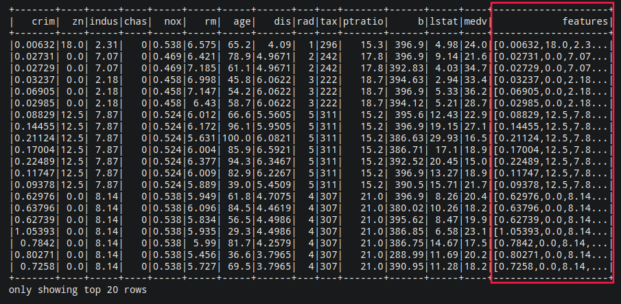
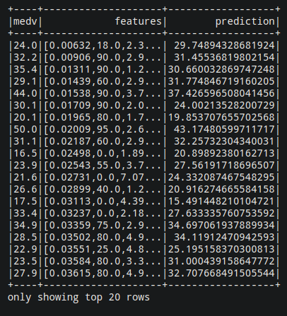

<div style="text-align:center;font-size:30px">﷽</div>


<div style="text-align:center;font-size:48px">Regression Linear Avec Spark</div>


---


# ENVIRONNEMENT DE TRAVAIL


Le but de ce mini projet est de démarrer avec la bibliothèque `MLlib` d'`Apache Spark`. Je vais essayer de résoudre certains cas d'utilisation intéressants d'apprentissage automatique de manière bien structurée. À la fin, j'obtiendrai un modèle ML bien formé qui résoudra un problème réel.

Dans la première partie, je me concentrerai sur l'obtention des données et leur préparation au traitements ( **data Pre-Processing** ), ce qui est une tâche très importante dans la journée d'un data scientiste. Je passerai ensuite à la véritable formation du modèle. Puis ça validation.

Pour faire je ai travaille dans l'environnement suivant:

-  Python
-  Apache Spark
-  findspark library
-  Numpy
-  Jupyter

## Apache Spark

**Apache Spark** est un *open-source cluster-computing framework*. Développé à l'origine à l'Université de Californie, l'AMPLab de Berkeley. Spark fournit une interface pour la programmation de clusters entiers avec parallélisme de données implicite et tolérance aux pannes.

>  **Installation**: Pour l'installer il suffit de télécharger le package du site officiel puis suivi les étapes de l'installation.

>  **Tester l'installation**: exécuter cette commande `/path/to/spark/bin/pyspark --version`

## MLlib

**Apache Spark MLlib** est une *bibliothèque d'apprentissage automatique* composée d'algorithmes et d'utilitaires d'apprentissage communs, y compris la classification, la régression, le clustering, le filtrage collaboratif et la réduction de dimensionnalité.

>  **Installation**: inclue dans Spark par défaut.

## findspark

Pour faciliter l'accès à Apache Spark, nous utiliserons **findpark**. Il s'agit d'une bibliothèque très simple qui configure automatiquement l'environnement de développement pour importer la bibliothèque Apache Spark.

>  **Installation**: exécuter la commande suivante (Il faut que `pip3` soit installé) `pip3 install findspark`

## Numpy

**Numpy** est une célèbre *bibliothèque de calcul numérique* en Python.

>  **Installation**: exécuter la commande suivante `pip3 install numpy`

## Jupyter

Le bloc-notes **Jupyter** est une *application Web open source* qui vous permet de créer et de partager des documents contenant du code en direct, des équations, des visualisations et du texte narratif. Les utilisations incluent: le nettoyage et la transformation des données, la simulation numérique, la modélisation statistique, la visualisation des données, l'apprentissage automatique et bien plus encore.

>  **Installation**: exécuter la commande suivante (Il faut que `pip3` soit installé) `pip3 install jupyter`


---

# TRAVAIL

## ACQUISITION DU DATA-SET

Dans ce mini-projet, j'essaierai de faire un modèle de régression linéaire pour prédire le fameux jeu de données ***Boston Housing***. (Télécharger [ICI](https://drive.google.com/open?id=1-zxrKH1T0fM1Oi1mZzCWNtzHzeM4OsKt))

Cet ensemble de données contient des informations collectées par le *U.S Census* Service concernant le logement dans la région de *Boston Mass*. Il a été obtenu à partir des archives *StatLib* et a été largement utilisé dans la littérature pour comparer les algorithmes.

L'ensemble de données est de petite taille avec seulement 506 cas. Il contient 14 fonctionnalités décrites comme suit:

+  **CRIM**: taux de criminalité par habitant par ville
+  **ZN**: la proportion de terrains résidentiels zonés pour des lots de plus de 25 000 pi.ca.
+  **INDUS**: proportion d'acres commerciales non commerciales par ville.
+  **CHAS**: variable fictive Charles River (1 si le tronçon délimite la rivière; 0 sinon)
+  **NOX**: concentration en oxydes nitriques (parties pour 10 millions)
+  **RM**: nombre moyen de pièces par logement
+  **AGE**: proportion des logements occupés par leur propriétaire construits avant 1940
+  **DIS**: distances pondérées vers cinq centres d'emploi de Boston
+  **RAD**: indice d'accessibilité aux autoroutes radiales
+  **TAXE**: taux d'impôt foncier de pleine valeur pour 10 000 $
+  **PTRATIO**: ratio élèves / enseignant par ville
+  **B**: 1000 (Bk - 0,63) ² où Bk est la proportion de noirs par ville
+  **LSTAT**:% de statut inférieur de la population
+  **MEDV**: valeur médiane des logements occupés par leur propriétaire en milliers de dollars

L'objectif est d'utiliser les 13 fonctionnalités pour prédire la valeur du **MEDV** (qui représente le prix du logement).


## PRE-TRAITEMENT DU DATA-SET

Pour démarrer on va créer une nouveau **notebook** de **jupyter** pour faire:

```shell
$ jupyter notebook
```

Puis on import la bibliothèque `findsparke`

```python
import findspark
findspark.init('/opt/spark')
```

Puis on démarre une `SparkSession`

```python
from pyspark.sql import SparkSession
spark = SparkSession.builder.getOrCreate()
```

Puis on lis la data-set

```python
data = spark.read.csv('./boston_housing.csv', header=True, inferSchema=True)
# header = True signale que la première ligne contient l'en-tête
# inferSchema = True permet la détection automatique du schéma de données sous-jacent
```

Pour visualiser les données

```python
data.show()
```


Maintenant pour la partie amusante… Les algorithmes de `MLlib` s'attendent à ce que les données soient représentées dans deux colonnes: Fonctionnalités et Étiquettes. Fonctionnalités est un tableau de points de données de toutes les fonctionnalités à utiliser pour la prédiction. Les étiquettes contiennent l'étiquette de sortie pour chaque point de données.

Dans notre exemple, les caractéristiques sont les colonnes de 1 à 13, les étiquettes sont la colonne **MEDV** qui contient le prix.

```python
feature_columns = data.columns[:-1]
from pyspark.ml.feature import VectorAssembler
assembler = VectorAssembler(inputCols=feature_columns,outputCol="features")
# outputCol = "features" définit le nom du vecteur de sortie qui combine toutes les valeurs
data_2 = assembler.transform(data)
```

Maintenant on remarque la création d'une nouvelle colonne nommée «fonctionnalités» qui contient toutes les valeurs combinées dans une liste

```python
data_2.show()
```



Comme dans tout flux de travail d'apprentissage automatique, nous divisons les données en train et test. Ici, nous l'avons divisé en 70% d'exemples de train et 30% d'exemples de test.

```python
train, test = data_2.randomSplit([0.7, 0.3])
```

Maintenant on a terminé la préparation des données pour l training. On peut commencer le travail sur le modèle.


## CONSTRUCTION DU MODÈLE

On va utiliser la classe `LinearRegression` pour le **training** du modèle

```python
from pyspark.ml.regression import LinearRegression
```

Puis on définie la colonne des **features** et la colonne des **labels**

```python
algo = LinearRegression(featuresCol="features", labelCol="medv")
```

Maintenant c'est le temps du **training**

```python
model = algo.fit(train)
```

Et voila on a construit un modèle de **ML** dans **Spark**.

## ÉVALUATION DES PERFORMANCES

Pour tester les performances de notre modèle on va essayer de prédire les **labels** de la **test-set** puis voir **l'erreur absolu moyen** ou **Le coefficient de détermination (R^2^)** ou **L’écart quadratique moyen** par exemple. Pour faire

```python
evaluation_summary = model.evaluate(test)
evaluation_summary.meanAbsoluteError
# Output: 3.4605272652624652
evaluation_summary.rootMeanSquaredError
# Output: 4.721035911637129
evaluation_summary.r2
# Output: 0.7643918170167411
```

On remarque de **R^2^** est proche de 1 donc on accepte le modèle. 

## PRÉDICTION DES DONNÉES NON ÉTIQUETÉES

Pour prédire les sorties de données non étiquetées, vous appelez la fonction `model.transform` tout en transmettant votre `DataFrame`.

Par exemple on va essayer de prédire les **labels** du test-set 

``` python
predictions = model.transform(test)
```

Pour voir nos résultats

 ```python
predictions.select(predictions.columns[13:]).show()
# J'ai filtrer les resultats pour des resons d'affichage
 ```




---

# BIBLIOGRAPHIE ET WEBOGRAPHIE

1. [Spark documentation](https://spark.apache.org) (en)
2. [The Boston Housing Dataset](https://www.cs.toronto.edu/~delve/data/boston/bostonDetail.html) (en)
3. [How to validate a predictive model ?](https://www.aspexit.com/en/how-to-validate-a-predictive-model/) (en)
