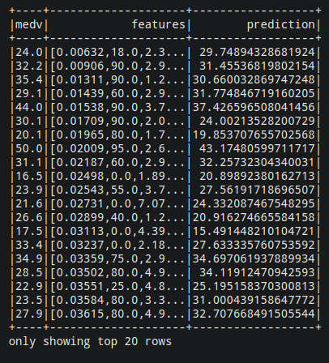

<div style="text-align:center;font-size:30px">﷽</div>


<div style="text-align:center;font-size:48px">Linear regression using Spark</div>


Work done by **Mehdi CHEBBAH**

---


# Table of Contents

[TOC]

---

# WORKING ENVIRONMENT

The goal of this mini project is to get started with the `MLlib` library of `Apache Spark`. I will try to solve some interesting machine learning use cases in a well structured way. In the end, I will get a well-trained ML model that solves a real-world problem.

In the first part, I will focus on getting the data and preparing it for processing ( **data Pre-Processing** ), which is a very important task in a data scientist's day. I will then move on to the actual training of the model. Then it's validation.

To do this I work in the following environment:

- Python
- Apache Spark
- findspark library
- Numpy
- Jupyter

## Apache Spark

**Apache Spark** is an *open-source cluster-computing framework*. Originally developed at the University of California, Berkeley's AMPLab. Spark provides an interface for programming entire clusters with implicit data parallelism and fault tolerance.

>  **Installation**: To install it just download the package from the official website and follow the installation steps.

>  **Test the installation**: run this command `/path/to/spark/bin/pyspark --version`

## MLlib

**Apache Spark MLlib** is a *machine learning library* that includes common machine learning algorithms and utilities, including classification, regression, clustering, collaborative filtering and dimensionality reduction.

>  **Installation**: included in Spark by default.

## findspark

To facilitate access to Apache Spark, we will use **findpark**. This is a very simple library that automatically configures the development environment to import the Apache Spark library.

>  **Installation**: run the following command (you must have `pip3` installed) `pip3 install findspark`

## Numpy

**Numpy** is a famous *numerical calculation library* in Python.

>  **Installation**: run the following command `pip3 install numpy`.

## Jupyter

**Jupyter** Notepad is an *open source web application* that allows you to create and share documents containing live code, equations, visualizations and narrative text. Uses include: data cleaning and transformation, numerical simulation, statistical modeling, data visualization, machine learning and more.

>  **Installation**: run the following command (it requires `pip3` to be installed) `pip3 install jupyter`


---

# GETTING HANDS DIRTY

## Dataset acquisition

In this mini-project, I will try to make a linear regression model to predict the famous ***Boston Housing*** data set. (Download [HERE](https://drive.google.com/open?id=1-zxrKH1T0fM1Oi1mZzCWNtzHzeM4OsKt))

This dataset contains information collected by the *U.S Census* Service regarding housing in the *Boston Mass* area. It was obtained from the *StatLib* archive and has been widely used in the literature to compare algorithms.

The dataset is small with only 506 cases. It contains 14 features described as follows:

+ **CRIM**: Crime rate per capita by city
+ **ZN**: the proportion of residential land zoned for lots larger than 25,000 sq. ft.
+ **INDUS**: proportion of non-commercial commercial acres by city.
+ **CHAS**: Charles River dummy variable (1 if the section borders the river; 0 otherwise)
+ **NOX**: nitric oxide concentration (parts per 10 million)
+ **RM**: average number of rooms per dwelling
+ **AGE**: proportion of owner-occupied dwellings built before 1940
+ **DIS**: weighted distances to five Boston employment centers
+ RAD**: radial highway accessibility index
+ **TAXE**: full value property tax rate per $10,000
+ **PTRATIO**: student/teacher ratio by city
+ **B**: 1000 (Bk - 0.63) ² where Bk is the proportion of blacks per city
+ **LSTAT**: % lower status of population
+ **MEDV**: median value of owner-occupied housing in thousands of dollars

The goal is to use the 13 features to predict the value of **MEDV** (which represents the price of housing).

## Dataset pre-processing

To get started we'll create a new **notebook** of **jupyter** to do:

```shell
$ jupyter notebook
```

Then we import the `findsparke` library

```python
import findspark
findspark.init('/opt/spark')
```

Then we start a `SparkSession`:

```python
from pyspark.sql import SparkSession
spark = SparkSession.builder.getOrCreate()
```

Then we read the dataset:

```python
data = spark.read.csv('./boston_housing.csv', header=True, inferSchema=True)
# header = True means that the first line contains the header
# inferSchema = True allows automatic detection of the underlying data schema
```

To visualize the data:

```python
data.show()
```


Now comes the fun part... The `MLlib` algorithms expect the data to be represented in two columns: Features and Labels. Features is an array of data points of all the features to be used for prediction. The labels contain the output label for each data point.

In our example, the features are the columns from 1 to 13, the labels are the **MEDV** column which contains the price.

```python
feature_columns = data.columns[:-1]
from pyspark.ml.feature import VectorAssembler
assembler = VectorAssembler(inputCols=feature_columns,outputCol="features")
# outputCol = "features" defines the name of the output vector that combines all values
data_2 = assembler.transform(data)
```

Now we notice the creation of a new column named "features" which contains all the values combined in a list

```python
data_2.show()
```


As in all machine learning workflows, we divide the data into train and test. Here, we split it into 70% train examples and 30% test examples.

```python
train, test = data_2.randomSplit([0.7, 0.3])
```

Now we have finished preparing the data for training. We can start working on the model.

## Model construction

We will use the `LinearRegression` class for the **training** of the model

```python
from pyspark.ml.regression import LinearRegression
```

Then we define the column of **features** and the column of **labels**.

```python
algo = LinearRegression(featuresCol="features", labelCol="medv")
```

Now it's time for **training**

```python
model = algo.fit(train)
```

And voilà, we have built a model of **ML** in **Spark**.

## Performance evaluation

To test the performance of our model we will try to predict the **labels** of the **test-set** and then see the **mean absolute error** or **coefficient of determination (R^2^)** or **mean square deviation** for example. To do so:

```python
evaluation_summary = model.evaluate(test)
evaluation_summary.meanAbsoluteError
# Output: 3.4605272652624652
evaluation_summary.rootMeanSquaredError
# Output: 4.721035911637129
evaluation_summary.r2
# Output: 0.7643918170167411
```

We notice that **R^2^** is close to 1 so we accept the model. 

## Unlabelled data prediction

To predict the outputs of unlabeled data, you call the `model.transform` function while passing your `DataFrame`.

For example we will try to predict the **labels** of the test-set

``` python
predictions = model.transform(test)
```

To view our results

 ```python
predictions.select(predictions.columns[13:]).show()
# J'ai filtrer les resultats pour des resons d'affichage
 ```




---

# BIBLIOGRAPHY & WEBOGRAPHY

1. [Spark documentation](https://spark.apache.org) (en)
2. [The Boston Housing Dataset](https://www.cs.toronto.edu/~delve/data/boston/bostonDetail.html) (en)
3. [How to validate a predictive model ?](https://www.aspexit.com/en/how-to-validate-a-predictive-model/) (en)
